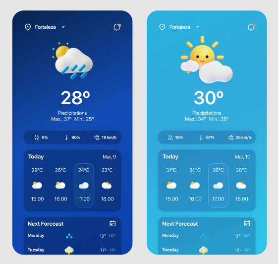

# Processo seletivo para desenvolvedor mobile

Olá,

Estamos em busca de pessoas que gostem de tecnologia e queiram fazer parte da nossa equipe de desenvolvimento mobile! Se você é um desenvolvedor apaixonado por novas tecnologias, que gosta de trabalhar em equipe e tem vontade de aprender, então essa é a sua chance.

O processo seletivo é simples, vamos pedir que você desenvolva um aplicativo, para que possamos avaliar seu potencial. A instrução completa esta mais abaixo.

Depois dessa etapa, vamos avaliar todos os candidatos que realizarem a submissão no tempo correto, que serão convidados para uma entrevista final, com parte do nosso time, para discutir os detalhes e forma de  trabalho, basicamente para verificarmos se vai dar "_match_".

Caso seja selecionado, você irá trabalhar em um ambiente descontraído e inovador, com profissionais de alta qualidade e muitas oportunidades de aprendizado. Além disso, terá a chance de participar do desenvolvimento de um projeto inovador na área da educação.

E então, vamos nessa? Mostre para nós que você é o profissional que estamos procurando!

## Instruções

Se você resolveu topar o desafio, vamos lá! Primeiro de tudo, faça o **fork** deste repositório. Você deverá desenvolver um aplicativo de previsão do tempo. O aplicativo pode ser desenvolvidor em [Flutter](https://flutter.dev/) ou [React-Native](https://reactnative.dev/).

O resultado final deverá ser parecido com:

Esta tela pode ser encontrada neste [Figma Community](https://www.figma.com/community/file/1158928016905524023) criado pela [@becabelin](https://www.figma.com/@becabelin). Claro que uma ou outra coisa pode ser adaptada, mas essa adaptação depois poderá ser questionada na entrevista.

Os dados podem ser consumidos da seguinte [API](https://api.hgbrasil.com/weather). Caso queira utilizar outra, escolha uma aberta e envie as intruções de uso, caso necessário.

Ao fim, altere o `README.md` com instruções para instalação e execução do aplicativo.

Os pontos que serão avaliados:

- fidelidade com o mock
- funcionalidade
- organização de componentes
- organização de commits
- organização de código

Boa sorte 🍀! Aguardamos sua submissão!
